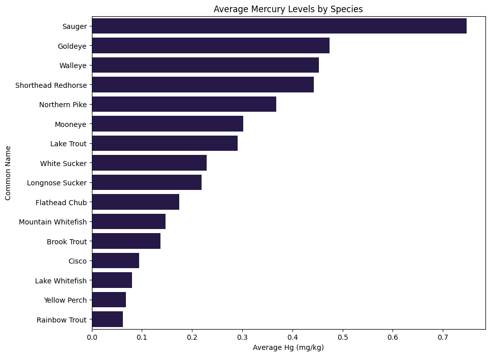
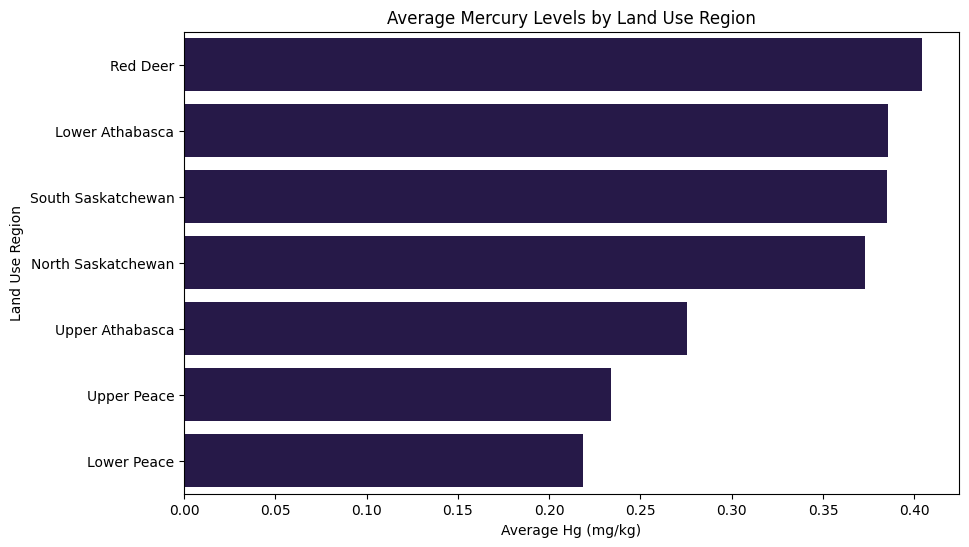
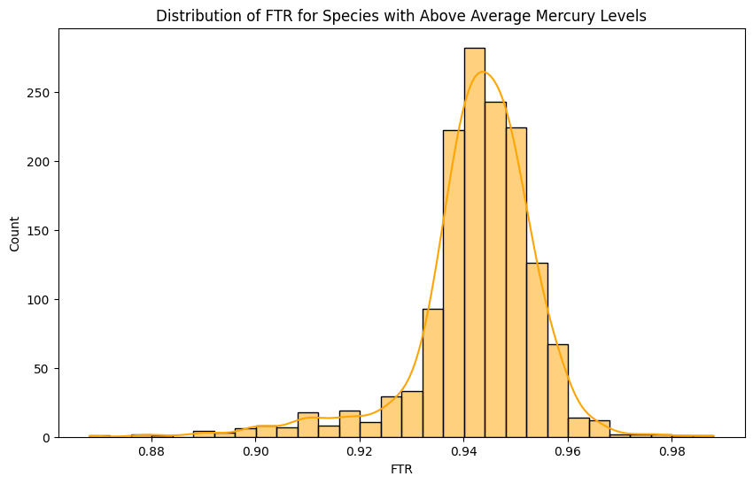
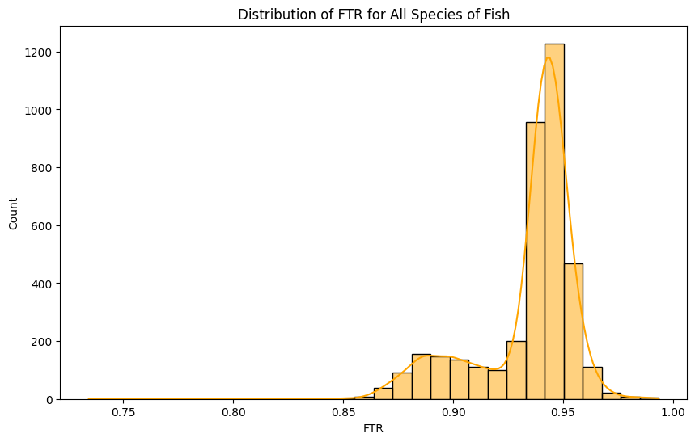
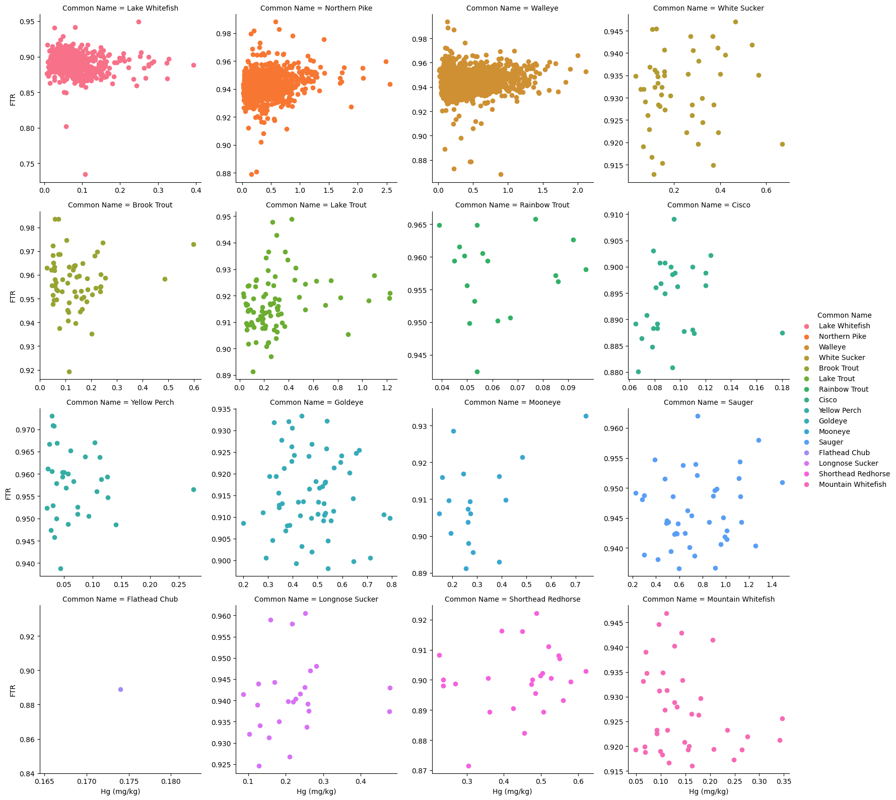
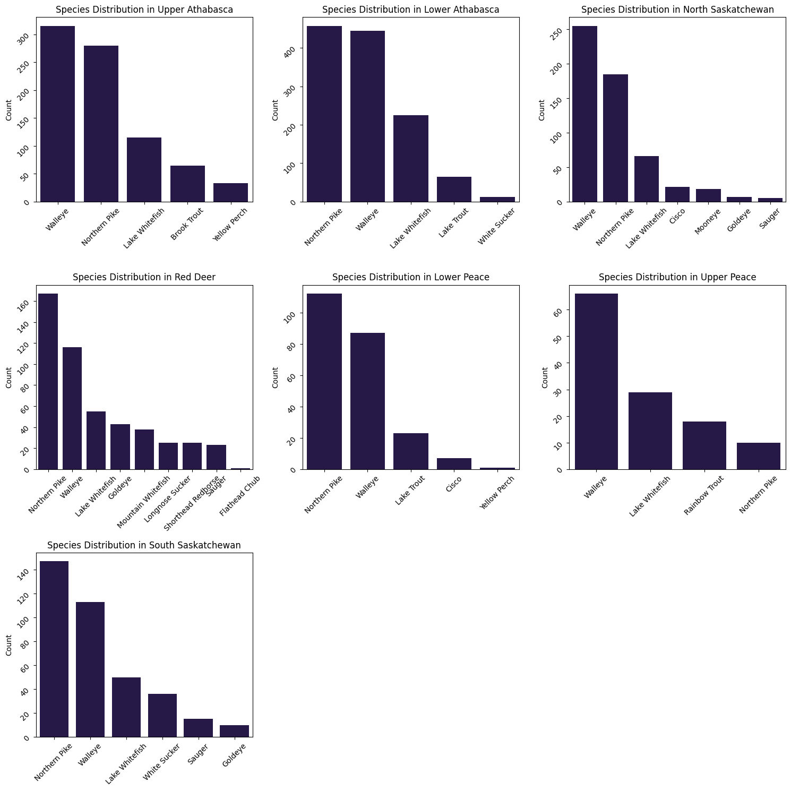

# Analysis of Mercury Levels in Albertan Fish

## Introduction

This repository contains an analysis of mercury levels in various fish species across Alberta. The goal is to identify regions and species exhibiting elevated mercury concentrations in various fish species, which could inform policy decisions, health advisories, and scientific research.

## Repository Structure

Mercury-Levels-in-Albertan-Fish/

* data/
  * mercury_levels_dataset.csv
* notebooks/
  * data_cleaning.ipynb
  * data_analysis.ipynb
* images/
  * analysis_visualization1.png
  * analysis_visualization2.png
* README.md

### Data

The data folder contains the files used in the analysis, sourced from the Government of Alberta’s open data portal, as well as the cleaned dataset, created in the Cleaning notebook.

* The dataset (`hg-in-fish_ah-1997-2020_20230921.xlsx`)
* The data dictionary (`hg-in-fish-column-dictionary.xlsx`)
* The cleaned dataset (`df_clean.csv`)

### Notebooks

* `Cleaning Steps - Hg in Albertan Fish.ipynb`: This notebook includes the process of cleaning and preparing the data for analysis.

* `Analysis - Hg in Albertan Fish.ipynb`: This notebook contains the analysis of the cleaned data, focusing on identifying patterns in mercury distribution and potential health defects in fish.

### Visualizations

The images folder contains visualizations generated during the analysis, providing a graphical representation of the key findings.

## Key Findings

* **Elevated Mercury in Specific Species**: The analysis identified five species with the highest average mercury concentrations, with Sauger at the top, followed by Goldeye, Walleye, Shorthead Redhorse, and Northern Pike.

* **Regional Mercury Distribution**: Fish in the Red Deer region exhibited the highest average mercury levels, with Lower Athabasca, South Saskatchewan, North Saskatchewan, and Upper Athabasca following. Lower Peace and Upper Peace regions had the lowest average mercury concentrations.

* **Fork Length to Total Length Ratio (FTR)**: No definitive relationship was established between mercury concentration and FTR across species. While some species like Lake Whitefish showed potential patterns, indicating an increase in FTR spread with higher mercury levels, a clear correlation was not discernible without further statistical analysis.

* **Species-Specific Analysis**: Scatterplot analysis suggested potential weak positive correlations between mercury levels and FTR in certain species, such as the Northern Pike and Walleye. However, for most species, no clear trend was observed.

* **Additional Insights**: An exploration of species distribution across various land use regions showed the diversity of fish tested and indicated potential areas for targeted studies on mercury concentration impacts.

These findings provide a foundational understanding of mercury distribution in Albertan fish and offer a stepping stone for more detailed studies that could include additional biological and environmental factors.

## Getting Started

To explore the analysis, start with the `Cleaning Steps - Hg in Albertan Fish.ipynb` notebook, followed by `Analysis - Hg in Albertan Fish.ipynb`.

## Contact

For any inquiries, please reach out to [Naveed Dhanji](mailto:nav.dhanji@icloud.com).

## Acknowledgments

Special thanks to [Open Alberta](https://open.alberta.ca/opendata/chemical-monitoring-in-local-foods-mercury-in-fish) for providing the dataset.
